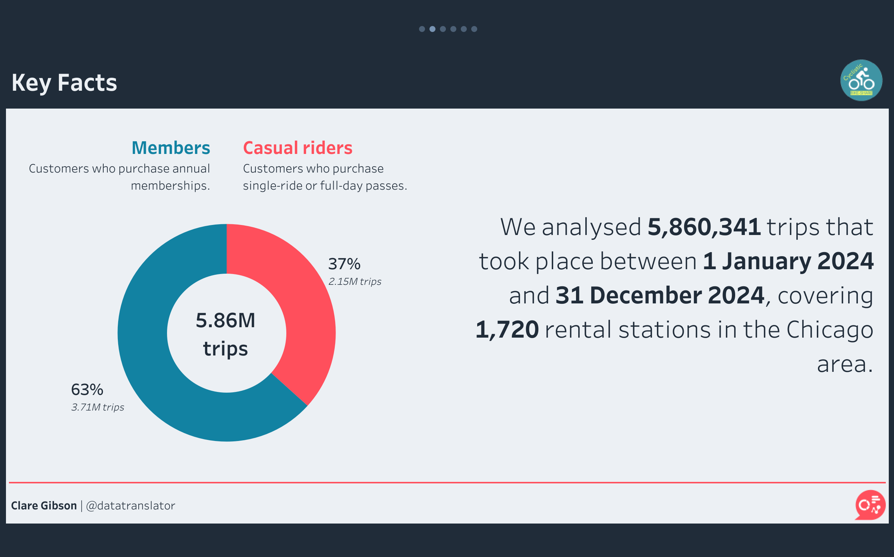
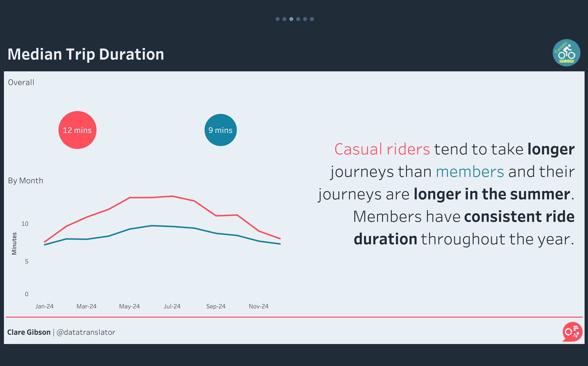
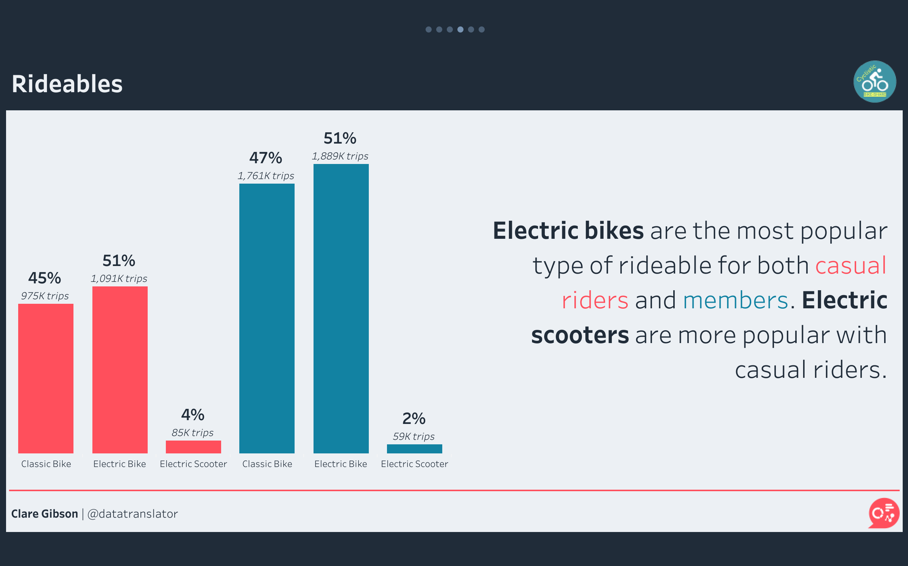
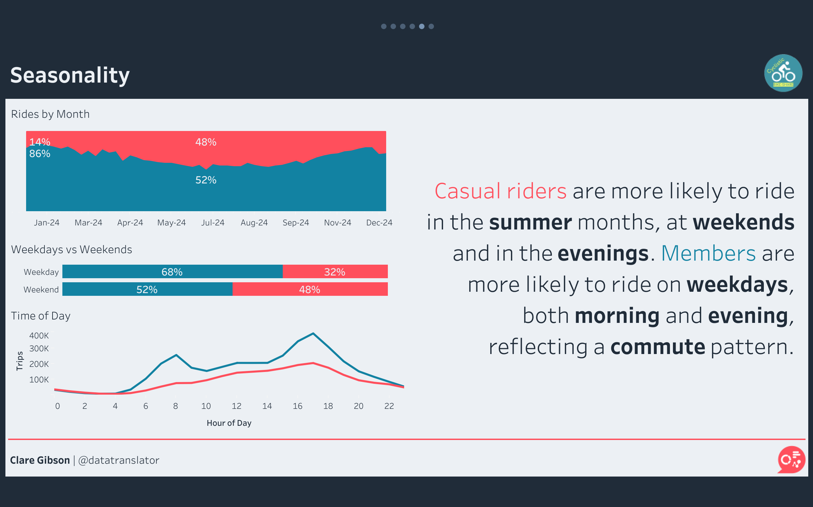



## Context

Cyclistic is a fictional bike-share company operating in Chicago, US. To unlock growth, Cyclistic wants to launch a campaign to convert casual riders into subscribed members. This case study explores the different ways that casual riders and members use Cyclistic, and offers recommendations of actions that could be taken to encourage conversions.

## Approach

I analysed twelve months of trip data for 2024, published by Divvy, the real Chicago bike-share system that the fictional Cyclistic is based on. The dataset held almost 6 million trips. I prepared and analysed the data in R, using the tidyverse, and built the final visualisations in Tableau.

### Assessing the data

Before relying on the data, I assessed it against the ROCCC principles: reliable, original, comprehensive, current and cited. It passed on four counts but failed on reliability. Over a million trips were missing station information, and station identifiers were applied inconsistently across the year. Knowing this up front shaped the cleaning decisions that followed.

### Cleaning and judgement calls

Three issues needed a decision rather than a simple fix.

**Missing station data.** More than a million records had no start or end station. Rather than delete them outright, I looked at where the gaps came from and found they were concentrated among electric-bike trips. I tried to recover the stations from the latitude and longitude, but the relationship between coordinates and station proved to be many-to-many, so this wasn't reliable. I chose to exclude these records only from the questions that depend on station data, and keep them for everything else, preserving as much of the dataset as possible.

**Inconsistent station identifiers.** Ninety-seven station IDs were linked to more than one name, and forty-nine names to more than one ID. I reconciled these to a one-to-one mapping so that each station resolved to a single identity.

**Negative trip durations.** When I calculated trip duration I found 227 trips that ended before they began, with the most extreme running to −2,748 minutes. I excluded these as clearly erroneous.

### Preparing for analysis

With the data clean, I engineered the fields needed for the analysis (trip duration, and the month, weekday and time of day of each trip) and organised everything into a dimensional data model. I managed the project reproducibly, using `renv` to lock package versions and `here` to keep file paths portable, so the analysis can be rerun from the repository without modification.

## Findings

The ratio of members to casual riders is roughly 2:1.

I chose to look at trip duration, bike type and seasonality differences between the two groups in order to offer recommendations to Cyclistic.

### Trip duration

I found that casual riders take longer trips than members, especially in the summer time. Members have a consistent ride duration throughout the year. One reason for this could be that members are using their trips for a specific, routine purpose (such as commuting), whereas casual riders are riding for pleasure or exercise.

### Bike type

I found that electric bikes are the most popular rideable for both members and casual riders. Electric scooters are more popular with casual riders, though their usage represents just 4% of all casual trips.

### Seasonality

During the summer months, the number of trips made by each group is roughly the same. But in winter, members outnumber casual riders by about 6 to 1. Casual riders tend to ride at weekends and in the evenings, whereas members ride on weekdays with peaks both in the morning and the evening, reflecting a commute pattern.

## Recommendations

Based on my analysis, I offer two recommendations to the Cyclistic marketing team:

1. Choose a summer launch for your marketing campaign. Casual riders are more likely to use Cyclistic during the summer months so launching a campaign in May will coincide with peak demand.
2. Offer flexible subscriptions. Casual riders may be deterred from subscribing because they don't ride as frequently. Consider off-peak subscriptions for rides starting after 9am, or weekend or summer-only subscriptions.

## Limitations and next steps

This analysis covers a single year, so the seasonal and weekly patterns I found are a snapshot rather than a confirmed trend. Looking at several years of data would show whether they hold from one year to the next, or whether 2024 was unusual.

The data also can't identify individual riders. For privacy reasons, trips aren't linked to people. This matters for the business question: I can describe how casual riders and members behave differently, but I can't tell how many casual riders are realistic candidates for membership. A casual rider who is a one-off visitor to Chicago will never convert, however the campaign is designed, whereas a local who rides most weekends might. Without a way to tell them apart, the true size of the conversion opportunity stays uncertain.

Finally, I didn't analyse the data geographically. The missing and inconsistent station information described above made location an unreliable dimension, so I set it aside. With that data cleaned more fully, a natural next step would be to map where casual riders concentrate (e.g. tourist routes along the lakefront) so that marketing could target specific areas as well as specific times of year.