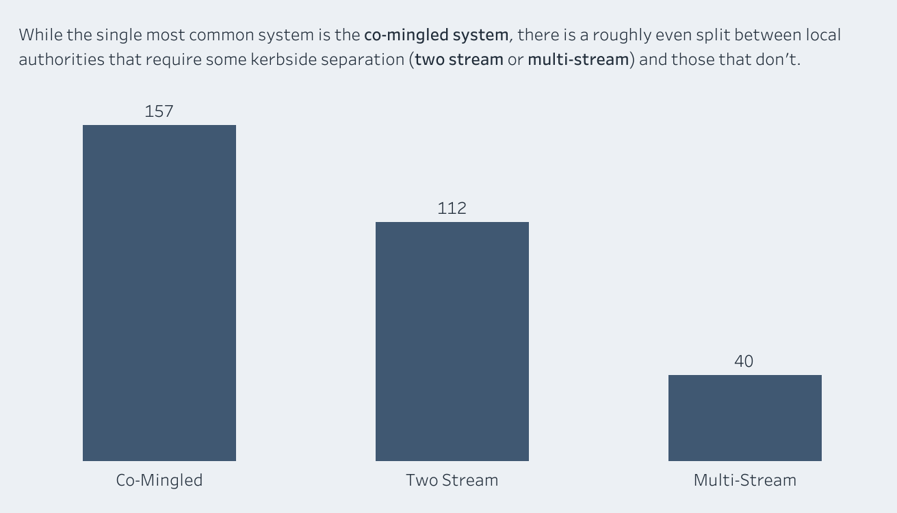
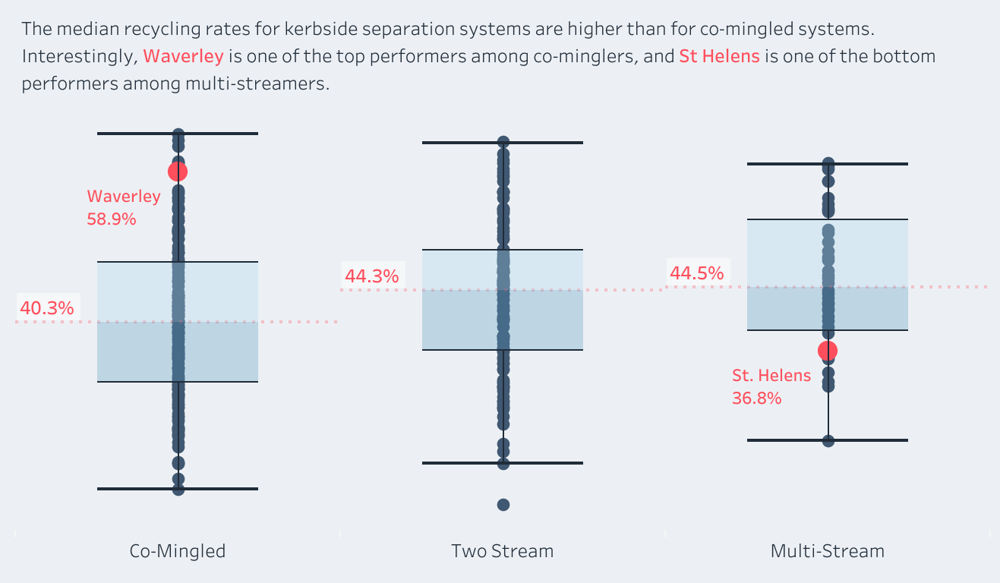



## Context

I recently visited my parents, who live in St Helens, a town in Merseyside, north-west England. One evening while I was there, the conversation turned to the new recycling bag that the council had just issued to every household in the borough. Despite the promise made by the then-Prime Minister Rishi Sunak that [he would never allow 'seven bins' per household](https://www.mrw.co.uk/news/government-will-never-allow-seven-bins-per-house-says-sunak-20-09-2023/), it seemed [St Helens Borough Council was doing exactly that](https://www.sthelens.gov.uk/article/9028/Recycling-Service-Change). The new 70L green bag that my parents received brought their total household waste receptacle count to exactly seven:

- **Green bag** for cardboard
- **Blue bag** for paper
- **Black box** for glass
- **White bag** for plastic and cans
- **Grey caddy** for food waste
- **Green bin** for garden waste (a subscription service)
- **Brown bin** for general and non-recyclable waste

This system of recycling, called [kerbside sort](https://en.wikipedia.org/wiki/Kerbside_collection#United_Kingdom), puts the burden of sorting the recyclable material on the resident. Kerbside sort systems can be two-stream (a smaller number of separate containers) or multi-stream (many separate containers, as in St Helens). As my mum can attest, it is pretty onerous and sometimes confusing to work out what belongs in each bin or box, and when they each have to be put out for collection. In other parts of the UK, including in Waverley, where I live, the local authority employs a [co-mingled recycling](https://en.wikipedia.org/wiki/Single-stream_recycling) system, where all of the non-organic recyclable material is put into a single bin and the sorting takes place at a [Materials Recovery Facility](https://en.wikipedia.org/wiki/Materials_recovery_facility).

## Question

> **Do councils who employ a kerbside sort system achieve higher recycling rates than those who employ the co-mingled system?**

Mum and I looked up the latest recycling rates for Waverley and St Helens and were surprised to discover that St Helens, with its [multi-stream system](https://en.wikipedia.org/wiki/Kerbside_collection#United_Kingdom), recycled just **36.8%** of household waste in FY2021/22, compared to Waverley, with its [co-mingled system](https://en.wikipedia.org/wiki/Single-stream_recycling), which achieved **58.9%** in the same period (source: [Defra](https://www.gov.uk/government/statistical-data-sets/env18-local-authority-collected-waste-annual-results-tables-202122)).

## Approach

To answer the question, I collected data about recycling systems and rates for all 309 local authorities in England in 2021. Recycling rates for each local authority are published by [Defra](https://www.defra.gov.uk) using the [WasteDataFlow](https://www.wastedataflow.org/home.aspx) web-based reporting system. At the time of conducting this research, the most recent figures available were for the 2021-2022 financial year. Recycling rates were calculated by dividing the volume of household waste sent for recycling, composting or reuse by the total volume of household waste collected. Non-household waste was not included in this research.

Details of the type of recycling system in place (co-mingled, two-stream or multi-stream) in each local authority were not easily available. I could not find a public data source for this information, so I took a two-pronged approach to obtain it. First, I launched a [Google Forms survey](https://docs.google.com/forms/d/e/1FAIpQLSeppOvUryPiswe9vXgp2kO-8jdZSwrUkCNC73NzOk0BkzmF7A/viewform?usp=sf_link), which asked respondents to provide the name of their local authority, whether they had household or communal waste collection and how many containers they had for recyclable materials. I shared the survey within my social networks and on [SurveyCircle](https://www.surveycircle.com). In parallel, I submitted a Freedom of Information (FOI) request to Defra to obtain the data. The survey collected 41 responses and provided some interesting insights into people's thoughts and concerns with their recycling collections. Ultimately, the FOI request provided me with a consistent and verified source of the data I needed. I have published the results and data from the FOI request [here](https://docs.google.com/spreadsheets/d/1M36p2m3Y59JvwW-a8sD-xXGADIkoe10N/edit?usp=share_link&ouid=110132729826719978887&rtpof=true&sd=true).

To build the analysis dataset, I joined the FOI data on recycling system and the Defra recycling rates to the ONS local authority codes, then linked this combined dataset to the boundary shapefile to enable mapping. I also joined the mid-2021 population estimates to provide the population figures shown as context on the map view of the dashboard.

My final dataset comprised recycling data from 309 local authorities in England. Of these, 157 used a co-mingled system, 112 used a two-stream system and 40 used a multi-stream system.

## Findings

Local authorities using a co-mingled system achieved a median recycling rate of 40.3%, compared with 44.3% for two-stream and 44.5% for multi-stream. A Kruskal-Wallis test confirmed that this difference is unlikely to be down to chance (*p* = 0.007), and it survives when controlling for the size of the authority. But the effect is modest: collection system explains less than 3% of the variation in recycling rates between authorities.

The pattern is not a simple ladder. Two-stream and multi-stream authorities are statistically indistinguishable from one another, differing by just 0.2 percentage points. What appears to matter is whether households separate their recycling at all, not how finely they separate it. The jump from one bin to two captures the effect; the jump from two to seven adds nothing detectable.

It is interesting that the highest recycling rate in 2021 belonged to Three Rivers (63.5%), a co-mingled authority, while the lowest was Barrow-in-Furness (17.7%), which separates into two streams. Whatever drives recycling performance, the choice of bin system is only a small part of it.

## Conclusion

So, does the collection system have a meaningful impact on recycling rate? The honest answer is: a little, but less than you might expect.

There is a real difference, and it is not trivial in size. Authorities that ask householders to separate their recycling are associated with higher rates than those that collect everything co-mingled, by around 4 percentage points at the median. Applied nationally, a shift of that size would be a meaningful policy outcome.

But the burden of separation appears to pay off only at the first step. Asking householders to sort into ever more streams, as St Helens now does with its seven containers, is not associated with any further gain over a simpler two-stream system. And most of what separates a high-recycling authority from a low-recycling one, some 95%, lies outside the collection system altogether.

There are also good reasons a council might choose a system regardless of its effect on rates. Without access to a Materials Recovery Facility to sort co-mingled waste, kerbside separation may be the only practical option. The choice is shaped by infrastructure, cost and geography, not made freely on the basis of expected recycling rate.

## Limitations and next steps

This analysis covers a single financial year and English local authorities only. More importantly, it controls only for the size of each authority. The factors most likely to influence recycling rates, such as deprivation, how rural or urban an area is, and its housing stock (flats recycle far less well than houses, whatever bins they are given), were not available in the dataset. Furthermore, the analysis does not account for differences in the materials collected for recycling in different local authorities. For example, some local authorities provide a separate collection for food waste, meaning that food waste contributes to the overall recycling rate. Others advise that food waste should be co-mingled with other non-recyclable household waste, meaning that food waste does not contribute to the recycling rate. Some authorities do not offer any kerbside collection of glass, instead asking householders to take their glass to a bottle bank. If householders do not have the means to access a bottle bank, they may choose to dispose of their glass waste with the general household waste. The differences reported here should therefore be read as associations, not causes.

The obvious next step is to build peer groups of genuinely comparable authorities using these contextual factors, then compare collection systems within each peer group. That is the subject of the next phase of this project.